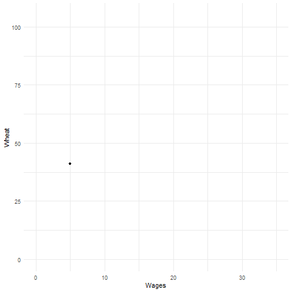
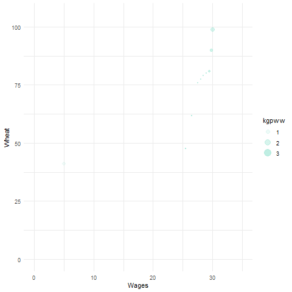

Imports for libraries that are used for the project. In this project ggplot2 has been used for data visualization. While gganimate is used for two animated visualizations in Task 3.
```{r}
library("ggplot2")
library("gganimate")
library("gifski")
```


# Load the provided data
The data for this project is loaded and a summary of the data is presented, where we can spot if there is something strange with the data.

```{r}
df <- read.csv("https://raw.githubusercontent.com/vincentarelbundock/Rdatasets/master/csv/HistData/Wheat.csv", header=T, strip.white=TRUE);

```

```{r}
summary(df);
```
# Dealing with missing data
From the summary above we can see that some values are missing, with the summary of **Wages** containing three missing values. In order to see which rows have missing values, they are extracted with the following code. After execution, we can see that the three rows containg missing values are rows *51*,*52* and *53*, were the wages values are missing. No other values are missing from the dataframe.
```{r}
missingData <- df[rowSums(is.na(df)) > 0,];
print(missingData);
```
Here we remove the rows which contain the missing data. Then the new dataframe is printed where we can see that the new dataframe is now 50 rows (53 rows before removal of missing data). From the printed version we can see that the correct values are missing. A summary of the new data is also provided, where we can see that we don't have any more missing data.
```{r}
newDF = na.omit(df);
print(newDF);
summary(newDF);
```
# Sampled Periods
As additional preprocessing, we are going to check that the time between all sampled years is the same, as well as that we don't have missing periods. After executing the following code, we know that there are no missing period and all sampled years are 5 years apart.
```{r}
l <- c()
len<-nrow(newDF)
i<-1
k<-1
currentYear<-0
while(i<len){
  if (i==1){
    currentYear<-newDF$Year[1]
  }else if(currentYear+5==newDF$Year[i]){
    currentYear<-currentYear+5
  } else{
    l[k]<-newDF$Year
    k <- k + 1
  }
  if(newDF$Year[i]%%5!=0){
    l[k]<-newDF$Year
    k <- k + 1
  }
  i <- i + 1
}
print(l)
```


# Task 1
The first task is to create similar to the Playfair graph where we create a bar graph for the price of the wheat per 15 punds and with a line graph we indicate the wage per week. From the image provided compared to the graph bellow, we can conclude that we can reproduce this graph. The only notable difference between the two is the missing last three bars in our plot because we have removed the rows containing missing values, while in the original graph, those three bars are presented without the corresponding wages.

```{r}
ggplot(data=newDF, aes(x=Year, y= Wheat)) +
  geom_bar(stat = "identity", fill="steelblue")+
  geom_line(aes(y=Wages), colour="red")+
  theme_minimal() +
  labs(y = "shillings",x = "Year")
```
# Task 2
In this task, the visualization from the first tasks is improved by adding a second y axis, so that on one side we have the price of wheat for 15 pounds and on the other we have the weekly wage. The x axis stays the same, representing the years.
```{r}
ggplot(data=newDF, aes(x=Year, y= Wheat)) +
  geom_bar(stat = "identity", fill="steelblue")+
  geom_line(aes(y=Wages), colour="red")+
  theme_minimal() +
  scale_y_continuous(sec.axis = sec_axis(~.,name = "Weekly wage"))+
  labs(y = "Wheat Price for 15 pounds",
                x = "Year")
```

# Task 3
The first task that we have to do is to compute what is the price of one kilogram of wheat for each year. In the wheat column we have the price for a quarter, which is about 6.8 kg. For that, a copy of the current dataframe is created so that the data can be traced at all times. In addition, in the new dataframe, a new column **pricepkg** is added that would contain the price of wheat for one kilogram. The price of for the kilogram is rounded to two decimal places in order to be easier to read and connect to real world prices.
```{r}
dfWithAdditionalData<- data.frame(newDF)
dfWithAdditionalData$pricepkg<-round(newDF$Wheat/6.8,digits = 2)

print(dfWithAdditionalData)
  
```
After we have computed, the price for one kilogram of wheat, we add a new column **kgpww** which would contain the amount of wheat that could be bought using a weekly wage. For this column, three decimal places are used in order to present the kilograms as well as the grams of wheat that can be bought.
```{r}
dfWithAdditionalData$kgpww<-round(dfWithAdditionalData$Wages/dfWithAdditionalData$pricepkg,digits = 3)
print(dfWithAdditionalData)
```
In the following visualization, the amount of wheat for weakly wage (in kilograms) is plotted where we can see how the amount changes for each year of the period (orange line). Moreover, a smooth line has been plotted (blue line) which shows the general trend of how the amount of wheat was gradually growing until the peak has been reached and then the amount has started to gradually decrease.
```{r}
ggplot(data = dfWithAdditionalData, aes(x = Year, y = kgpww)) + 
     geom_line(color = "#FC766A", size = 1) +
     stat_smooth(color = "#5B84B1",method = "loess" ) +
     theme_minimal()
```
In the following visualization, a scatter plot has been used to illustrate the relationship between the price of wheat for 15 pounds and the weekly wage. The pasage of time here has been shown by a color gradient. The earlier years are represented with lighter color, an for every 50 years the colors becomes darker. This graph allows us to group the years together and allows us to see trends for specific sets of years. The size of the bubbles in this scatterplot depend on the amout of wheat a worker can buy with their weekly wage.
```{r}
ggplot(dfWithAdditionalData, aes(x=Wages, y=Wheat,size = kgpww, alpha=Year)) + 
    geom_point(color = "#684793") +
  xlim(0, 35) +
  ylim(0, 105) +
    theme_minimal()
```
In the next graph, the relationship betwee wheat and wages is represented, but here the passage of time is done by animation.
```{r}
ggplot(dfWithAdditionalData, aes(x=Wages, y=Wheat)) +
    geom_line(color="#4EDCCA") +
    geom_point() +
    theme_minimal() +
    xlim(0, 35) +
    ylim(0, 105) +
    transition_reveal(Year)

anim_save("animated.gif")

```


In the next visualization, a animated bubble chart is used, where the wheat and wages are compared. The passage of time is again presented using animation. In addition, the size of the bubble and it color depend on the amout of wheat a worker could buy at that time. What is more, a tail has been used to make the following of the bubble easier.
```{r}
ggplot(dfWithAdditionalData, aes(x = Wages, y = Wheat, size = kgpww, alpha=kgpww)) +
  geom_point(color="#AFEADC") +
  xlim(0, 35) +
  ylim(0, 105) +
  theme_minimal()+
  transition_time(Year)+
  shadow_wake(wake_length = 0.1, alpha = FALSE)

anim_save("animatedBubble.gif")
```


From all four visualizations created for task 3, the most successful that gives the most information to the user is the first one (time series), because it shows the buying power of workers and the general trend. A reason for the first graph to be prefered is because it would be easies to understand, the user would understand the meaning of it without prior knowledge of anything else. The second most successful visualization is the animated one, where the animation makes it easier to understand the passage of time. The next most successful visualization is the scatterplot, where we get the progression of the years via color gradient, but we don't they are still divided in 5 categories, so if we are looking for a specific year, it would be very difficult to find it. The least successfult visualization is the animated bubble chart, because even with the tail, it is difficult to follow, but at the same time this visualization contains the most information overall.


